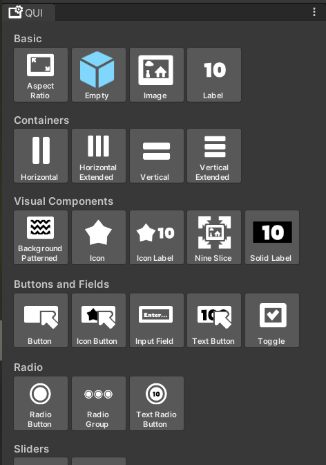

# QUI (Unity extension)
## Introduction
Have you ever caught yourself being too tired to implement a nice user inteface, because the process was too repetitive and even confusing sometimes? QUI was developed with those issues in mind and will help you achieve your desired results in the blink of an eye!

## The idea behind the project
The main idea behind this extension was to have a library of generic, diverse, modifiable and ready-to-use UI prefabs. 
Some notable examples are:
 - ContainerHorizontal/Vertical
	 - Is an already pre-tuned Horizontal/VerticalLayoutGroup, which allows a user to make a responsive  list of elements.
 - RadioGroup
	 - Works in a combination with RadioButtons and allows a user to add a radio group without writing a single line of code (that's really convenient, trust me).

The extension itself is based on UGUI, which is considered a default UI option in Unity. 

## Worth mentioning
This extension was developed as a tool for personal use, therefore it wasn't tested properly on any other version of Unity, except of Unity 2022.3.4.f1.

Source code is located in Project/Assets/Scripts.